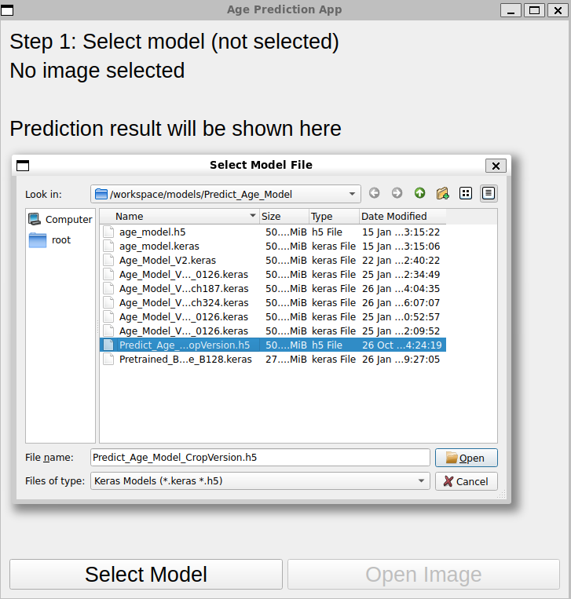
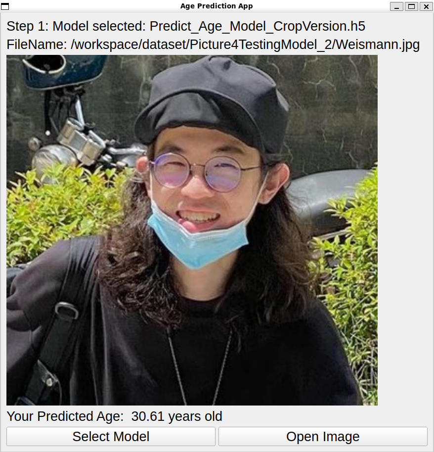

# Age\_Predict

## This repo is for age predict projection mission using ML model, which combine with GUI.

This program allow users predict the age using their own face image.
In UI, you can also choose with different model to estimate.

### Example 
<table>
  <tr>
    <td align="center">
       
      Step 1: Model selection
    </td>
    <td align="center">
       
      Step 2: Prediction result
    </td>
  </tr>
</table>

### Environment Setup
This program development on the environment below : 

Hardware : 

1. Nvidia RTX 5060
2. AMD I7 350

Attention. If your GPU is not the Nvidia Blackwell Gen, then you don’t have to follow the software requests below.
Just find the Tensorflow 2.10.0, which is the last version support GPU on windows directly, and everything can still work out.

Software : 

1. WSL2 with Ubuntu 24.04
2. Image : Nvidia NGC Tensorflow container 
3. Container : Docker desktop
4. Container Tool : Dev container in VS code
5. Requirement.txt with all ML tool you want to build in this container.
6. Docker file 
7. Devcontainer.json

### How to use install and use this program

### How to tweak this project for your own use 

### Known Issues and working on progress
The dataset used for age prediction training exhibits a common issue of extreme data imbalance: certain age groups are significantly underrepresented, while others are heavily overrepresented. This skewed distribution undermines the model's generalization capability, making it prone to overfitting on dominant age groups and underperforming on underrepresented ones.

In this training, the imbalance was partially addressed by trimming overrepresented age ranges and removing a few age groups with extremely sparse data at the distribution tails. While this helped achieve a more balanced dataset, such data reduction may also lead to insufficient training samples, potentially degrading the model’s convergence and real-world performance.

Therefore, there remains room for improvement in training strategies. For example, data augmentation could help preserve sufficient sample diversity while maintaining distributional balance. Alternatively, adopting pre-trained models with stronger generalization in image-based tasks may improve performance, particularly on age ranges with limited data.
